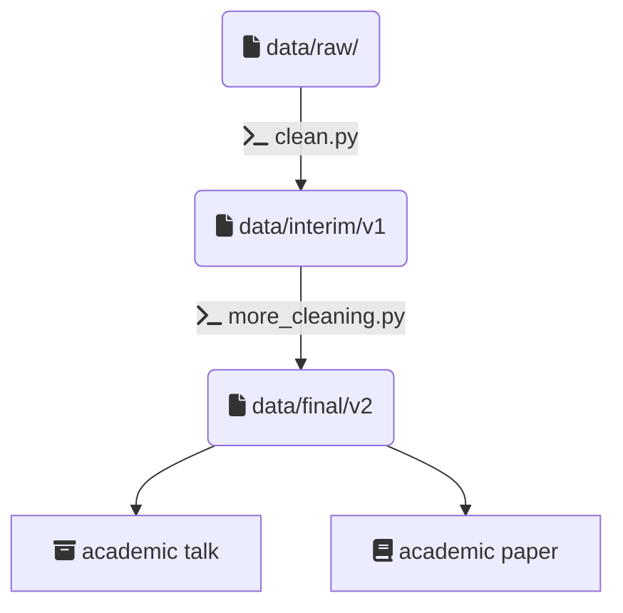
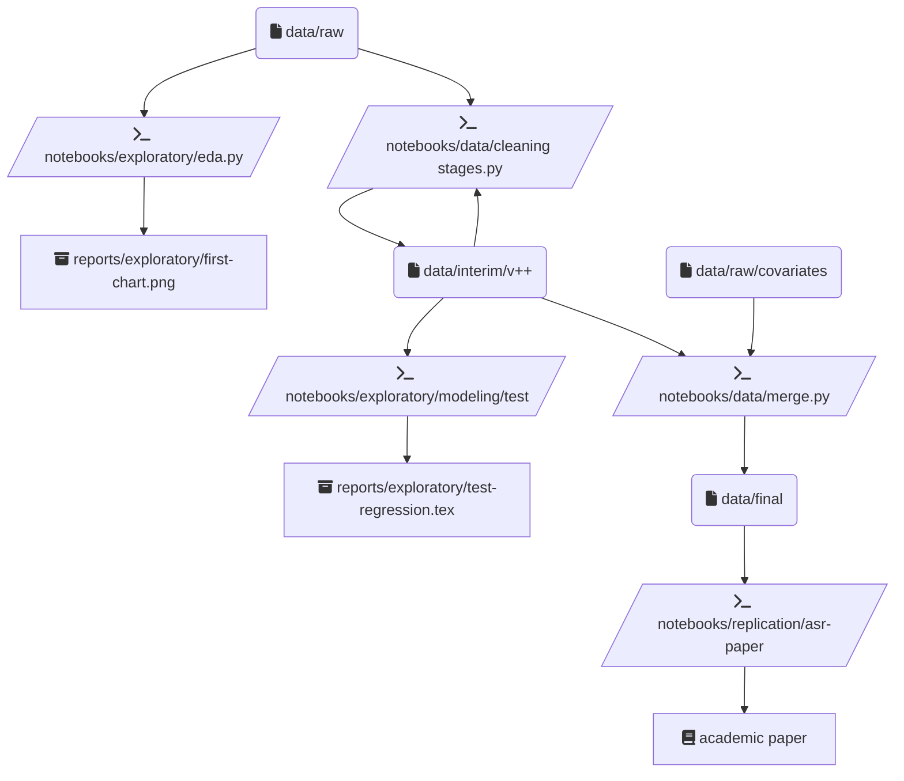

Reproducible Science
====================

A boilerplate for reproducible and transparent science with close resemblances to the philosophy of [Cookiecutter Data Science](https://github.com/drivendata/cookiecutter-data-science) and Mario Krapp's (cookiecutter)[https://github.com/mkrapp/cookiecutter-reproducible-science]: *A logical, reasonably standardized, but flexible project structure for doing and sharing data science work.*

This template is designed to document the creation of a dataset/presentations/papers. It has been refined over several research projects at the (UChicago Justice Project)[https://github.com/uchicago-justice-project]. 

An idealized data science workflow:



Setup
------------
Install `cookiecutter` command line: 

`pip install cookiecutter`    

To start a new science project:

`cookiecutter gh:eric-mc2/cookiecutter-reproducible-science`

Create local python package from src to allow relative imports in notebooks (optional):

`cd <repo-name>; pip install -e`

Project Structure
-----------------

```
.
├── AUTHORS.md
├── LICENSE
├── README.md
├── data                    <- (not tracked by git. maybe tracked by DVC)
│   ├── raw                 <- The original, immutable data dumps from primary or third-party sources.
│   ├── interim             <- Intermediate data that has been transformed.
│   ├── final               <- The final, canonical data sets for modeling.
│   └── replication         <- Final data that was used in a paper, talk, etc.
|       └── my-paper        <- One folder per task/presentation
├── docs                    <- Documentation, e.g. data dictionaries, memos, project notes
├── notebooks               <- Ipython or R notebooks
│   ├── data                <- Scripts and programs to process data
│   ├── exploratory         <- One-offs (one script per task)
│   └── replication         <- Report-generating scripts that were used in a paper, talk, etc. (one script per presentation)
├── reports                 <- For all non-data project outputs
|   ├── exploratory         <- One-offs
|   |   └── my-task         <- One folder per task/presentation
|   |       ├── figures     <- Visualizations
|   |       ├── tables      <- Descriptive tables
|   |       └── regressions <- Model outputs
│   └── replication         <- Outputs that were presented in a talk, paper, etc. (promote exploratory subfolders into here)
├── setup.py                <- Allows importing python files from src into notebooks
└── src                     <- Source code for this project
    ├── data                <- Scripts and programs to process data
    ├── stats               <- Source code for modeling and statistics
    ├── viz                 <- Scripts for visualisation of your results, e.g., matplotlib, ggplot2 related.
    └── util                <- Any helper scripts go here
```

Usage / Recommendations
------------

1. Pull your data into data/raw.
2. Apply transformations. 
    a. Transformed data goes in data/interim.
    b. All transformations increment the data version number, e.g. (census_v1.csv).
    c. Keep previous data versions! Storage is cheap!
    e. The highest-version files that are part of the "final product" go in data/final.
    f. Whenever you revise the "final" data, just move the file to interim, and add the new incremented version to final.
3. Document all transformations in src/data or notebooks/data. 
    a. If the process was manual, still document it as a comment-only script.
    b. Number all pipeline files in the order they should run.
4. Promote all data, outputs, and scripts related to "published" work into replication.

A more realistic research data science workflow:



License
-------
This project is licensed under the terms of the [BSD License](/LICENSE)
